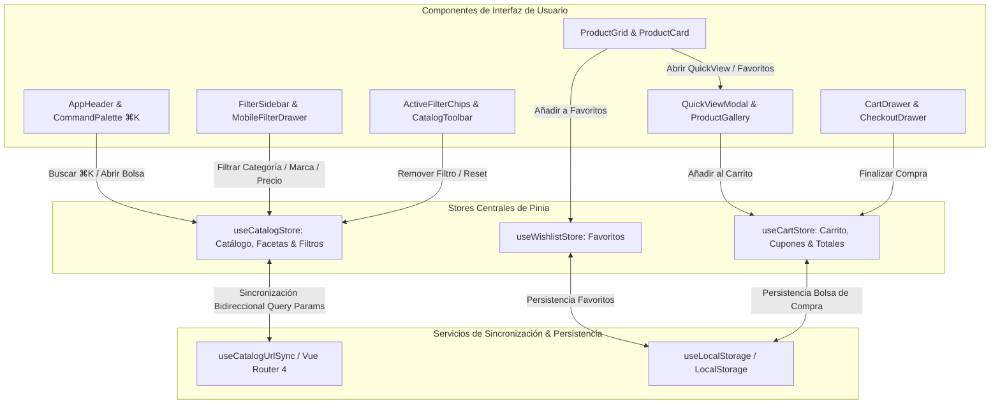

# Aurelia Atelier — Catálogo de Moda de Lujo y Motor de Filtrado Multifacetado con Vue 3.5 & Pinia

<div align="center">


**Plataforma de comercio electrónico de alta costura con motor de filtrado multifacetado dinámico en tiempo real, sincronización bidireccional de parámetros URL con Vue Router y estética Obsidian & Amber Gold.**

[🚀 Demo en Vivo](https://alxnrocha.github.io/vue-catalog-filters/) • [📂 Repositorio en GitHub](https://github.com/alxnrocha/vue-catalog-filters)

</div>

---

## 🏛️ Arquitectura de Estado Reactivo (Pinia & Vue Router)



---

## ✨ Características Principales

1. **🎨 Sistema de Diseño Obsidian & Amber Gold (Tailwind CSS v4):**
   - Paleta curada con fondo Obsidian Slate (`#070A10`), microbordes metálicos (`border-zinc-800/80`), acentos en Oro Ámbar (`#F59E0B`), tipografía *Playfair Display* e *Inter*.

2. **🔍 Motor de Filtrado Multifacetado en Tiempo Real (`useCatalogStore.ts`):**
   - Recálculo algorítmico de existencias por faceta (categoría, marca, talla, color), slider de doble rango de precio independiente (€50 - €1.000) y chips de filtros activos removibles.

3. **🔗 Sincronización Bidireccional de URL (`useCatalogUrlSync.ts`):**
   - Sincronización automática de filtros en query string con **Vue Router 4** para compartir búsquedas y conservar estado.

4. **⚡ Paleta de Comandos Global (`CommandPalette.vue`):**
   - Acceso instantáneo con el atajo **`⌘K`** / **`Ctrl+K`** con búsqueda predictiva en 48 piezas de catálogo.

5. **💎 Tarjetas de Producto y Vista Rápida (`QuickViewModal.vue`):**
   - Conmutador Grid/List, previsualización de muestras de color y modal Quick View con altura áurea fija (`h-[600px]`).

6. **🛍️ Bolsa Deslizante & Checkout en 3 Pasos:**
   - Drawer de carrito con cálculo de envío gratis, cupones (`AURELIA20`) y checkout simulado validado con **VeeValidate + Zod**.

---

## 🗂️ Estructura del Proyecto

```text
17-vue-catalog-filters/
├── src/
│   ├── components/
│   │   ├── cart/                      # CartDrawer.vue
│   │   ├── catalog/                   # FilterSidebar, ProductGrid, PriceRangeSlider
│   │   ├── checkout/                  # CheckoutDrawer.vue
│   │   ├── common/                    # AppHeader, AppFooter, CommandPalette
│   │   └── quickview/                 # QuickViewModal, ProductGallery
│   ├── composables/                   # useCatalogUrlSync.ts
│   ├── data/                          # products.mock.ts (48 prendas exclusivas)
│   ├── router/                        # Vue Router 4
│   ├── stores/                        # useCatalogStore, useCartStore, useWishlistStore
│   ├── types/                         # Tipos TypeScript
│   ├── App.vue
│   └── main.ts
├── tests/                             # 44 pruebas unitarias con Vitest
├── package.json
├── tsconfig.json
└── vite.config.ts
```

---

## 🚀 Instalación y Puesta en Marcha

### Prerrequisitos
- Node.js `>= 20.0.0`
- npm `>= 10.0.0`

### Ejecución Local
```bash
# 1. Clonar el repositorio
git clone https://github.com/alxnrocha/vue-catalog-filters.git
cd vue-catalog-filters

# 2. Instalar dependencias
npm install

# 3. Iniciar servidor de desarrollo
npm run dev

# 4. Ejecutar suite de pruebas unitarias (44 tests)
npm test

# 5. Compilar para producción
npm run build
```

---

## 🛠️ Tecnologías Utilizadas

| Capa | Tecnología | Aspectos Clave |
|---|---|---|
| **Framework** | Vue 3.5 | Composition API, `<script setup>`, Reactividad nativa |
| **Enrutamiento** | Vue Router 4.5 | Sincronización bidireccional de parámetros query en URL |
| **Estado Global** | Pinia 3.0 | Stores modulares para catálogo, carrito y favoritos |
| **Lenguaje** | TypeScript 5.8 | Tipado estricto para entidades de alta costura |
| **Validación** | VeeValidate, Zod 3.24 | Validación reactiva del formulario de checkout |
| **Estilos** | Tailwind CSS v4 | Obsidian & Amber Gold, diseño responsive |
| **Testing** | Vitest, @vue/test-utils | 44 pruebas unitarias de facetas y cálculos |
| **Despliegue** | GitHub Pages | Despliegue estático continuo y optimizado |

---

<div align="center">
  <sub>Desarrollado con dedicación por <a href="https://github.com/alxnrocha">Alex Rocha</a> • Proyecto 17 del Portafolio Profesional Frontend.</sub>
</div>
