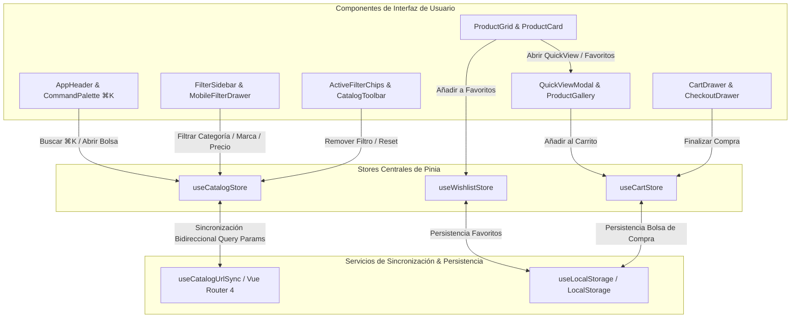

# Aurelia Atelier — Catálogo de Moda de Lujo y Motor de Filtrado Multifacetado con Vue 3.5 & Pinia

[](https://alxnrocha.github.io/vue-catalog-filters/)
[](https://vuejs.org/)
[](https://pinia.vuejs.org/)
[](https://router.vuejs.org/)
[](https://www.typescriptlang.org/)
[](https://tailwindcss.com/)
[](https://vee-validate.logaretm.com/)
[](https://zod.dev/)
[](https://vueuse.org/)
[](https://lucide.dev/)
[](https://vitest.dev/)
[](https://oxc.rs/)
[](LICENSE)

> **Proyecto 17 del Portafolio Profesional** — Plataforma de comercio electrónico de alta costura, catálogo de lujo y motor de filtrado multifacetado reactivo en tiempo real construida con Vue 3.5 (Composition API, `<script setup>`), sincronización bidireccional de parámetros URL con Vue Router, arquitectura de estado reactivo modular con Pinia, sistema de diseño Obsidian & Amber Gold con Tailwind CSS v4, paleta de comandos global (`⌘K`), modal interactivo de vista rápida con altura fija y sangría de fotos, bolsa de compras deslizante y checkout simulado con validación de esquemas Zod.  
> 🔗 **Demo en Vivo en GitHub Pages:** [https://alxnrocha.github.io/vue-catalog-filters/](https://alxnrocha.github.io/vue-catalog-filters/)

---

## 🌟 Visión General & Propuesta de Valor

**Aurelia Atelier** es una plataforma de descubrimiento y compra de moda de alta gama inspirada en los estándares de ingeniería de *Farfetch*, *SSENSE* y *Net-a-Porter*:

- **Motor de Filtrado Multifacetado Dinámico:** Cálculo algorítmico en tiempo real de facetas para categorías, marcas, tallas y colores, recalculando las existencias disponibles según el cruce exacto de todos los filtros aplicados y esmaeciendo opciones agotadas (`0`).
- **Sincronización Bidireccional de URL:** Enrutamiento reactivo que refleja cada filtro en la query string (`?category=chaquetas&minPrice=200&brand=Acne+Studios`), permitiendo compartir enlaces filtrados y restaurar el estado completo en recarga o historial.
- **Paleta de Comandos Global (`⌘K` / `Ctrl+K`):** Búsqueda predictiva ultrarrápida en catálogo completo de 48 piezas exclusivas con historial de búsquedas recientes persistente y navegación total por teclado.
- **Modal de Vista Rápida (Quick View):** Tarjeta con proporciones áureas (`h-[600px]`), galería fotográfica con sangrado total a los bordes, miniaturas con contornos vectoriales dorados nítidos, selector de tallas y estrellas de valoración fraccionarias calculadas matemáticamente.
- **Bolsa Deslizante & Checkout Seguro en 3 Pasos:** Drawer lateral con cálculo de envío gratis (umbral de 100€), motor de cupones promocionales (`AURELIA20`) y formulario de compra con validación de esquemas reactiva mediante VeeValidate y Zod.

---

## ✨ Características Principales

1. **🎨 Sistema de Diseño Obsidian & Amber Gold (Tailwind CSS v4):**
   - Paleta de colores curada con fondo Obsidian Slate (`#070A10`, `#0E1420`), microbordes metálicos (`border-zinc-800/80`), acentos en Oro Ámbar (`#F59E0B`), badges de alto contraste e iluminación de estado.
   - Tipografía contemporánea con *Playfair Display* para cabeceras y logotipos de alta costura, combinada con *Inter* para lectura técnica y *JetBrains Mono* para precios y numeración.
   - Contenedores panorámicos de alta fidelidad (`max-w-[1760px]`) que aprovechan la totalidad de pantallas modernas.

2. **🔍 Motor de Filtrado Multifacetado en Tiempo Real (`useCatalogStore.ts`):**
   - **Categorías con Estilo Chic:** Indicador lateral dorado minimalista (`border-l-2 border-amber-400`) y microdeslizamiento suave al posar el cursor (`hover:pl-3`).
   - **Slider de Doble Rango de Precio (`PriceRangeSlider.vue`):** Control independiente y fluido para precio mínimo (€50) y máximo (€1.000) con aislamiento de eventos de puntero (`pointer-events`).
   - **Muestrarios de Color Interactivos:** Filtros por muestras cromáticas reales (`#111827`, `#F9FAFB`, `#B48866`, etc.) con vista previa dinámica en tiempo real sobre las tarjetas de catálogo.
   - **Chips de Filtros Activos (`ActiveFilterChips.vue`):** Barra superior de tags removibles con botón de limpieza total (*Clear All*).

3. **🔗 Sincronización Bidireccional de URL (`useCatalogUrlSync.ts`):**
   - Sincronización automática de búsqueda, categorías, precios, colores, tallas, marcas, rating y ordenación con Vue Router 4.
   - Soporte nativo para botones Atrás/Adelante del navegador y persistencia de estado profunda en enlaces compartidos.

4. **⚡ Paleta de Comandos Global (`CommandPalette.vue`):**
   - Acceso instantáneo con el atajo universal **`⌘K`** o **`Ctrl+K`**.
   - Búsqueda predictiva multiatributo sobre nombre, marca, composición y descripción técnica.
   - Navegación por teclado completa con flechas de dirección (`↑`, `↓`), selección directa (`Enter`) y cierre inmediato (`Esc`).

5. **💎 Tarjetas de Producto y Vista Rápida (`QuickViewModal.vue`):**
   - **Conmutador de Vista (Grid & List):** Cuadrícula adaptativa de 4 columnas en resoluciones amplias y vista de lista densa de alta legibilidad.
   - **Previsualización de Variantes:** Cambio dinámico de fotografía al interactuar con los selectores de color de la tarjeta.
   - **Modal Quick View:** Previsualización sin recargar la página con altura fija inmutable, foto de alta resolución sin márgenes muertos y estrellas de valoración proporcionales al rating exacto.

6. **🛍️ Bolsa de Compras Lateral (`CartDrawer.vue`):**
   - Barra de progreso reactiva para envío gratuito a partir de 100€.
   - Motor de cupones de descuento con código exclusivo de bienvenida (`AURELIA20` para 20% de descuento directo).
   - Control dinámico de cantidades por prenda y selección de talla/variante.

7. **💳 Checkout Simulado en 3 Pasos (`CheckoutDrawer.vue`):**
   - Paso 1: Información de Envío con validación de formato de correo, teléfono y dirección mediante **Zod**.
   - Paso 2: Método de Pago Seguro (Tarjeta de Crédito con máscara y expiración, o simulación de Apple Pay / Google Pay).
   - Paso 3: Confirmación de Pedido con identificador único generado (`#AUR-2026-XXXXX`) y recibo digital.

8. **💾 Persistencia Reactiva en LocalStorage:**
   - Lista de favoritos (*Wishlist*) y bolsa de compras sincronizadas automáticamente en el almacenamiento local del navegador mediante VueUse.

---

## 🏛️ Arquitectura del Proyecto

```text
17-vue-catalog-filters/
├── .github/
│   └── workflows/
│       └── deploy.yml                 # Despliegue continuo automático a GitHub Pages
├── design/
│   ├── mockup.png                     # Mockup de alta fidelidad Desktop
│   └── PROMPTS.md                     # Especificaciones de diseño UI/UX (local)
├── src/
│   ├── assets/
│   │   └── base.css                   # Tokens de diseño, tipografía y Tailwind CSS v4
│   ├── components/
│   │   ├── cart/
│   │   │   └── CartDrawer.vue         # Bolsa de compras lateral deslizante
│   │   ├── catalog/
│   │   │   ├── ActiveFilterChips.vue  # Barra de chips de filtros activos removibles
│   │   │   ├── CatalogToolbar.vue     # Barra de herramientas (conteo, orden y vista)
│   │   │   ├── FilterSidebar.vue      # Barra lateral de filtros multifacetados
│   │   │   ├── MobileFilterDrawer.vue # Filtros móviles en panel deslizante
│   │   │   ├── PriceRangeSlider.vue   # Slider de doble rango de precio independiente
│   │   │   ├── ProductCard.vue        # Tarjeta de producto (Grid/List & Swatches)
│   │   │   └── ProductGrid.vue        # Cuadrícula de productos con paginación
│   │   ├── checkout/
│   │   │   └── CheckoutDrawer.vue     # Checkout en 3 pasos con VeeValidate + Zod
│   │   ├── common/
│   │   │   ├── AppFooter.vue          # Pie de página con enlaces institucionales
│   │   │   ├── AppHeader.vue          # Cabecera fija con buscador y accesos directos
│   │   │   └── CommandPalette.vue     # Paleta de comandos global (⌘K / Ctrl+K)
│   │   └── quickview/
│   │       ├── ProductGallery.vue     # Galería de imágenes de alta resolución
│   │       └── QuickViewModal.vue     # Modal interactivo con altura fija y rating
│   ├── composables/
│   │   └── useCatalogUrlSync.ts       # Sincronización bidireccional URL <-> Pinia
│   ├── data/
│   │   ├── brands.mock.ts             # Metadatos de marcas de lujo
│   │   ├── categories.mock.ts         # Metadatos de categorías
│   │   ├── colors.mock.ts             # Paleta cromática y códigos HEX
│   │   └── products.mock.ts           # Catálogo curado de 48 prendas exclusivas
│   ├── router/
│   │   └── index.ts                   # Configuración de rutas con Vue Router 4
│   ├── stores/
│   │   ├── useCartStore.ts            # Estado de la bolsa de compras y cupones
│   │   ├── useCatalogStore.ts         # Estado principal del catálogo y facetas dinámicas
│   │   └── useWishlistStore.ts        # Lista de favoritos con persistencia local
│   ├── types/
│   │   └── catalog.ts                 # Modelos de dominio y tipado estricto TypeScript
│   ├── views/
│   │   └── CatalogView.vue            # Vista principal del catálogo
│   ├── App.vue                        # Componente raíz de la aplicación
│   └── main.ts                        # Punto de entrada de Vue 3.5 con Pinia y Router
├── tests/
│   └── unit/
│       ├── ActiveFilterChips.spec.ts  # Pruebas de chips y limpieza de filtros
│       ├── CartDrawer.spec.ts         # Pruebas de bolsa de compras y subtotal
│       ├── CheckoutDrawer.spec.ts     # Pruebas de validación de formulario de compra
│       ├── CommandPalette.spec.ts     # Pruebas de búsqueda y atajos de teclado
│       ├── dataset.spec.ts            # Pruebas de integridad del catálogo de 48 prendas
│       ├── FilterSidebar.spec.ts      # Pruebas de acordeones y conteos de facetas
│       ├── MobileFilterDrawer.spec.ts # Pruebas del drawer móvil
│       ├── PriceRangeSlider.spec.ts   # Pruebas del slider de doble rango de precio
│       ├── primitives.spec.ts         # Pruebas de elementos base y diseño
│       ├── ProductCard.spec.ts        # Pruebas de renderizado y conmutación de color
│       ├── ProductGallery.spec.ts     # Pruebas de miniaturas y galería interactiva
│       ├── QuickViewModal.spec.ts     # Pruebas de modal de vista rápida
│       ├── smoke.spec.ts              # Prueba de humo de montaje de la aplicación
│       ├── useCartStore.spec.ts       # Pruebas unitarias de cálculo de bolsa y cupones
│       ├── useCatalogStore.spec.ts    # Pruebas de filtrado multifacetado y ordenación
│       ├── useCatalogUrlSync.spec.ts  # Pruebas de sincronización de parámetros URL
│       └── useWishlistStore.spec.ts   # Pruebas de favoritos y almacenamiento local
├── index.html                         # HTML5 con metadatos SEO y Google Fonts
├── package.json
├── tsconfig.json
└── vite.config.ts                     # Configuración Vite 6 con Tailwind v4 y alias @
```

---

## 📊 Diagrama de Arquitectura de Estado Reactivo (Pinia & Vue Router)



---

## 🚀 Instalación y Puesta en Marcha

### Prerrequisitos
- Node.js `>= 20.0.0` (Recomendado Node 22+)
- npm `>= 10.0.0`

### Pasos

1. **Clonar el repositorio:**
   ```bash
   git clone https://github.com/alxnrocha/vue-catalog-filters.git
   cd vue-catalog-filters/17-vue-catalog-filters
   ```

2. **Instalar dependencias:**
   ```bash
   npm install
   ```

3. **Iniciar el servidor de desarrollo:**
   ```bash
   npm run dev
   ```
   Abrir [http://localhost:5173](http://localhost:5173) en el navegador.

4. **Ejecutar la suite completa de pruebas unitarias (Vitest):**
   ```bash
   npm test
   ```

5. **Ejecutar el linter (Oxlint):**
   ```bash
   npm run lint
   ```

6. **Compilar el bundle de producción:**
   ```bash
   npm run build
   ```

---

## 🛡️ Calidad de Código & Testing

- **44 Pruebas Unitarias Automatizadas (Vitest + `@vue/test-utils`):** Cobertura completa de inicialización de stores, cálculo de facetas dinámicas, sincronización de query parameters, lógica de cupones y totales, renderizado de componentes y flujo de checkout.
- **Oxlint & TypeScript 5.7 Strict:** Cero advertencias y cero errores en la totalidad del código fuente con `vue-tsc -b` aprobado.
- **Rendimiento Ultraligero:** Bundle de producción optimizado con Vite 6 (161 kB JS gzip / 61 kB CSS) con carga instantánea y cero retardos en la interfaz.

---

## 📄 Licencia

Este proyecto se encuentra bajo la Licencia MIT. Consulta el archivo [LICENSE](LICENSE) para más detalles.
