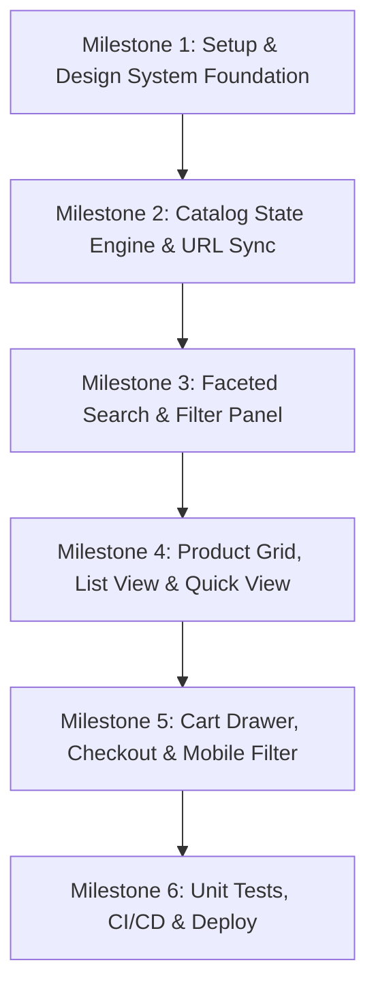

# 🎯 Projeto 17: Aurelia Atelier — Vue Catálogo & Filtros Dinâmicos

> **Repositório GitHub:** `https://github.com/alxnrocha/vue-catalog-filters`
> **Pasta Local:** `17-vue-catalog-filters/`
> **Fase:** Fase 4 — Adaptabilidade Vue 3.5 & Ecossistema Moderno (E-commerce / Catálogo de Luxo com Busca Facetada)

---

## 🛠️ Stack Tecnológica Completa (Zero Incompatibilidades)

| Camada | Tecnologia | Versão | Função Principal |
| :--- | :--- | :--- | :--- |
| **Core Framework** | **Vue.js** | `^3.5.0` | Framework progressivo reativo com `<script setup>` e Composition API |
| **Linguagem** | **TypeScript** | `^5.7.0` | Tipagem estrita de DTOs, filtros, carrinho e stores |
| **Build Tool / Bundler** | **Vite** | `^6.1.0` | Servidor dev ultrarrápido e bundling ESM otimizado |
| **Roteamento** | **Vue Router** | `^4.5.0` | Sincronização bidirecional de URL query params para deep linking |
| **State Management** | **Pinia** | `^3.0.0` | Gerenciamento de estado reativo com Setup Store Syntax (`defineStore(() => {})`) |
| **Formulários & Validação** | **VeeValidate** + **Zod** | `^4.14.0` / `^3.24.0` | Validação estrita de formulário de newsletter e checkout simulado |
| **Styling & Design** | **Tailwind CSS** | `^4.0.0` | Sistema de design moderno, tokens de luxo e dark theme |
| **Composables & Utilidades** | **@vueuse/core** | `^12.5.0` | `useLocalStorage`, `useDebounceFn`, `useWindowSize`, `useScrollLock` |
| **Ícones** | **lucide-vue-next** | `^0.475.0` | Ícones SVG consistentes, leves e responsivos |
| **Efeitos / Feedback** | **canvas-confetti** | `^1.9.0` | Feedback de compra confirmada no checkout simulado |
| **Testes Unitários** | **Vitest** + **@vue/test-utils** | `^3.0.0` / `^2.4.0` | Testes de stores Pinia, filtros, URL sync e componentes |
| **Linter & Qualidade** | **Oxlint** | `^0.15.0` | Linter em Rust ultraveloz para conformidade de código |
| **CI/CD & Deploy** | **GitHub Actions** | v4 | Pipeline automatizado de lint/test/build e deploy no **GitHub Pages** |

---

## 🗺️ Roadmap de Milestones & Issues

### 📍 Milestone 1: Setup & Design System Foundation
* [x] **Issue #01**: `chore: bootstrap Vue 3.5 + TypeScript + Vite + Tailwind v4 + Pinia + Vue Router project`
  - Setup do projeto, aliases `@/`, scripts de build, Oxlint, Vitest e estrutura de pastas.
* [x] **Issue #03**: `feat: implement Aurelia luxury design system tokens and base UI primitives`
  - Tokens de cor (Obsidian, Sand, Amber Gold), tipografia, botões, badges, inputs e App Header com navegação e atalhos.

### 📍 Milestone 2: Catalog State Engine & URL Sync (Pinia)
* [x] **Issue #04**: `feat: implement mock dataset and catalog types for luxury apparel and accessories`
  - Dataset com 24+ produtos ricos (categorias, marcas, preços, cores, tamanhos, avaliações, tags de desconto e estoque).
* [x] **Issue #05**: `feat: setup Pinia catalog store with faceted filtering, multi-criteria sorting and pagination`
  - Store `useCatalogStore` com filtros compostos, ordenação (preço, novidade, avaliação) e paginação calculada.
* [x] **Issue #06**: `feat: implement bidirectional URL query params synchronization with Vue Router`
  - Composable `useCatalogUrlSync` que reflete o estado da store na URL e carrega filtros de URLs compartilhadas.

### 📍 Milestone 3: Faceted Search & Filter Panel
* [x] **Issue #07**: `feat: build live search bar with autocomplete dropdown, recent searches and keyboard shortcuts`
  - Barra de busca com debounce, modal Command Palette (`⌘K`), destaque de termos e histórico recente.
* [x] **Issue #08**: `feat: build desktop faceted sidebar with category accordion, dual price slider and color swatches`
  - Painel lateral com categorias, slider duplo de preço com display numérico, swatches de cores, chips de tamanho e marcas com busca.
* [x] **Issue #09**: `feat: create active filter chips bar with removal and clear-all functionality`
  - Barra superior de tags ativas (`Chaquetas ✕`, `Negro ✕`, `€50 - €650 ✕`) com contagem de resultados dinâmicos.

### 📍 Milestone 4: Product Grid, List View & Quick View Studio
* [x] **Issue #10**: `feat: develop luxury product cards with hover preview, color variants, wishlist toggle and grid/list view`
  - Cards com efeito hover, pré-visualização de fotos, mini swatches de cores interativos, badge de desconto, botão de wishlist e layout Grid/List.
* [x] **Issue #11**: `feat: build quick view modal with high-res gallery, size selector, stock indicator and animated add-to-cart`
  - Modal rápido com galeria de miniaturas verticais, zoom suave, seletor de cores, seletor de tamanhos e botão de compra animado.

### 📍 Milestone 5: Cart Drawer, Checkout & Mobile Filter
* [x] **Issue #12**: `feat: build slide-over cart drawer with quantity stepper, promo code and order summary`
  - Drawer lateral da bolsa de compras com controle de quantidade (+ / -), barra de progresso de frete grátis (€100) e cupons de desconto (`AURELIA20`).
* [x] **Issue #13**: `feat: implement simulated checkout drawer with multi-step validation using VeeValidate and Zod`
  - Fluxo de checkout em 3 etapas (Contato/Entrega, Pagamento simulado com cartão e Confirmação com número de pedido gerado).
* [x] **Issue #14**: `feat: build mobile responsive slide-over filter bottom sheet with dynamic filter counts`
  - Painel lateral/inferior de filtros para dispositivos móveis com sincronização completa e botão 'Ver X resultados'.

### 📍 Milestone 6: Unit Tests, CI/CD & Deploy
* [ ] **Issue #15**: `test: write comprehensive unit tests with Vitest and Vue Test Utils for stores and components`
  - Cobertura de testes de filtros da store, sincronização de query params, carrinho e renderização de cards.
* [ ] **Issue #16**: `ci: configure GitHub Actions CI pipeline and automated GitHub Pages deployment`
  - Pipeline `.github/workflows/deploy.yml` e documentação técnica completa em `README.md`.
